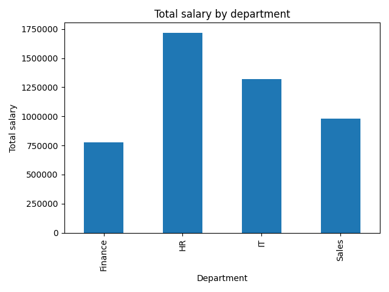

## Employee Salary Analysis (Python)

# Project Overview
This project clean and analyzes employee salary data using Python.  
The goal is to understand salary distribution, department-wise averages, and identify meaningful insights for business decision-making.

# Dataset
* Source: employees.csv
* Rows: 51(0 to 50)
*  Columns: emp_id, name, salary, department

# Tools Used
* Python
* Pandas
* NumPy
* Matplotlib

# Data Cleaning (Python) 
* Missing salaries replaced using department-wise averages
* Department names standardized (e.g., IT, Finance)
* Salary outliers identified for review
* Clean dataset exported as employees_cleaned.csv

# Analysis Performed
* Salary distribution analysis
* Department-wise salary comparison
* High / Low salary categorization
   
# Visualizations

# Key Insights
* Sales department has the highest average salary
* Finance shows the lowest salary budget
    ##  KPI Analysis (Python)

This project includes KPI-based analysis to support management decision-making.

# Key Insights
* Total payroll helps monitor overall company cost.
* High salary percentage indicates salary imbalance risk.
* Department cost share highlights budget-heavy departments.

These KPIs can help management optimize payroll and workforce planning.  
## Executive Dashboard Insights

# 1. Salary Cost Concentration
The HR department has the highest total salary cost, indicating critical technical dependency.

# 2. Salary Imbalance
Average salaries in Sales are significantly higher than Finance,  suggesting potential imbalance.

# 3. Workforce Distribution
HR has the highest number of employees, which may indicate operational workload concentration.

# 4. Recommendation
Management should review HR compensation and staffing to avoid burnout and imbalance.

